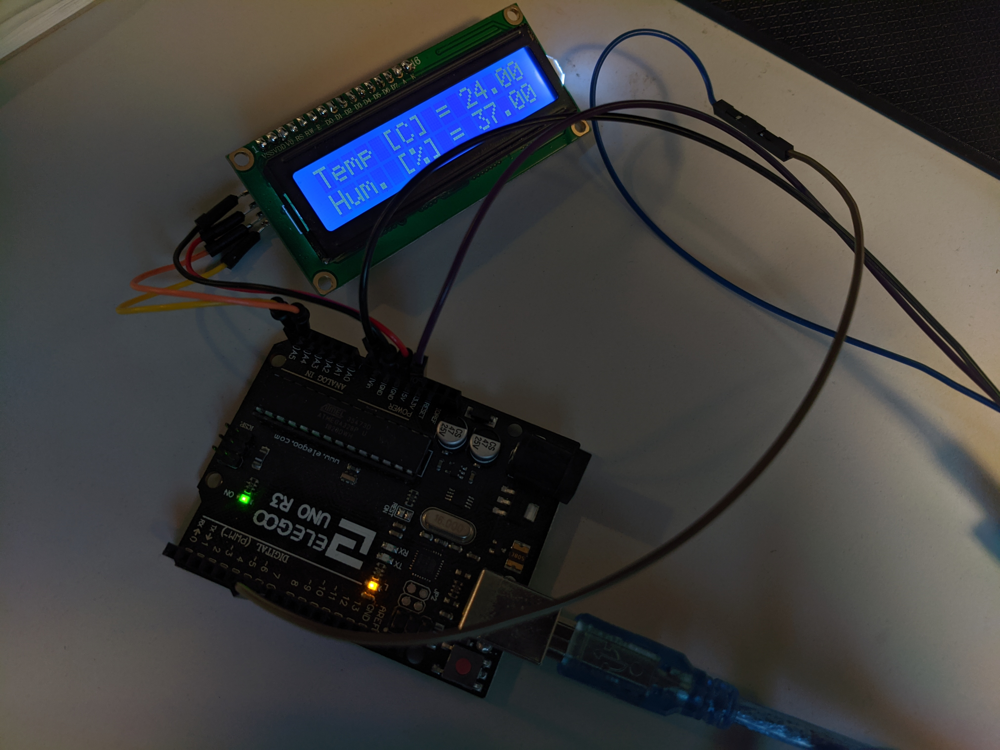
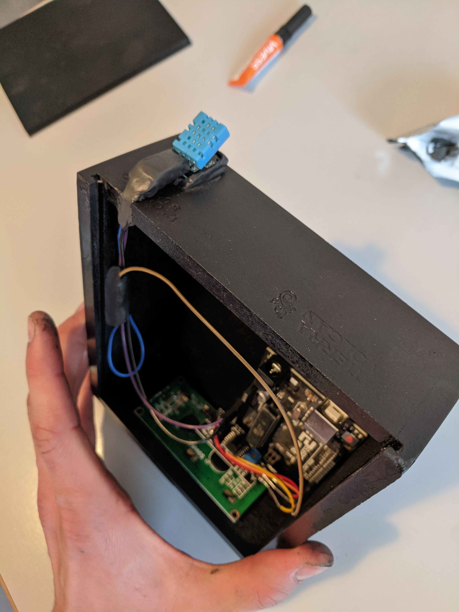

# Temp-and-Humidity-Sensor

**Simple temp and humidity Sensor to help create an optimal growing environment for plants at home**

## Parts list:

1x Arduino Uno

1x 16x02 LCD Display

1x I2C Interface (optional)

1x DHT11 Sensor

1x 4-AA Batteryholder

## Description:

## Schematic

## Set-Up

Displaying Values on the 16 x 02 LCD

Electronics housing with sensor (battery power Supply removed)
